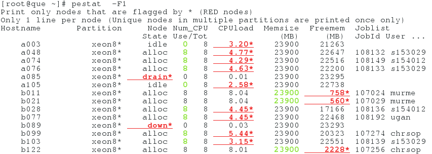

The Slurm tool "pestat" (Processor Element status)
--------------------------------------------------

Print Slurm nodes status with 1 line per node including job info.

Author: Ole Holm Nielsen <Ole.H.Nielsen \at/ fysik.dtu.dk>

Usage
-----

```
Usage: pestat [-p partition(s)] [-u username] [-g groupname] [-a accountname]
        [-q qoslist] [-s statelist] [-n/-w hostlist] [-j joblist] [-G] [-N]
        [-f | -F | -m free_mem | -M free_mem ] [-1|-2] [-d] [-E] [-C|-c] [-V] [-h]
where:
        -p partition: Select only partion <partition>
        -u username: Print only user <username>
        -g groupname: Print only users in UNIX group <groupname>
	-a accountname: Print only jobs in Slurm account <accountname>
        -q qoslist: Print only QOS in the qoslist <qoslist>
        -R reservationlist: Print only node reservations <reservationlist>
        -s statelist: Print only nodes with state in <statelist>
        -n/-w hostlist: Print only nodes in hostlist
        -j joblist: Print only nodes in job <joblist>
        -G: Print GRES (Generic Resources) in addition to JobId
        -N: Print JobName in addition to JobId
        -f: Print only nodes that are flagged by * (unexpected load etc.)
        -F: Like -f, but only nodes flagged in RED are printed.
        -m free_mem: Print only nodes with free memory LESS than free_mem MB
        -M free_mem: Print only nodes with free memory GREATER than free_mem MB (under-utilized)
        -d: Omit nodes with states: down drained
        -1: Default: Only 1 line per node (unique nodes in multiple partitions are printed once only)
        -2: 2..N lines per node which participates in multiple partitions
        -S: Job StartTime is printed after each jobid/user
        -E: Job EndTime is printed after each jobid/user
        -T: Job TimeUsed is printed after each jobid/user
        -C: Color output is forced ON
        -c: Color output is forced OFF
        -h: Print this help information
        -V: Version information
```

For continuous monitoring in a terminal window you may for example use this command:

```
	watch -n 60 --color 'pestat -f -C'
```

Example output
--------------



Installation
------------

Copy pestat:

```
wget https://raw.githubusercontent.com/OleHolmNielsen/Slurm_tools/master/pestat/pestat
chmod 755 pestat
cp pestat /usr/local/bin
```

If desired copy pestat.conf:

```
wget https://raw.githubusercontent.com/OleHolmNielsen/Slurm_tools/master/pestat/pestat.conf
cp pestat.conf /etc/
```

Edit pestat.conf according to your needs.
Users may copy and edit this file as ```$HOME/.pestat.conf```.

Configuration
-------------

Some Environment configuration lines lines near the top of pestat may need to be changed for your environment, for example:

```
# Directory where Slurm commands live:
export prefix=/usr/bin
```

The global configuration file for pestat: ```/etc/pestat.conf```

Per-user configuration file for pestat: ```$HOME/.pestat.conf```

It is strongly recommended that you do not change the pestat script itself,
but make changes only in the above mentioned configuration files for pestat
to suit your needs.

Please write to the author if additional configurations should be made possible.

History
-------

The pestat tool was inspired by a similar tool for Torque/PBS by David Singleton (Sep 23, 2004),
see https://github.com/abarbu/torque/blob/master/contrib/README.pestat

The present author later wrote a pestat bash script for Torque, see
http://www.clusterresources.com/pipermail/torqueusers/2007-September/006188.html
and https://ftp.fysik.dtu.dk/Torque/
